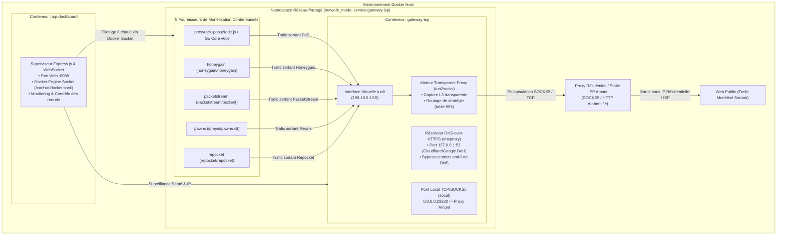

# Multi-Providers Monetization Hub & Residential ISP Gateway sur Docker

Système automatisé et sécurisé de monétisation de bande passante couplant une **passerelle réseau résidentielle / ISP dédiée** et **5 fournisseurs de monétisation** (Proxyrack, Honeygain, PacketStream, Pawns.app, Repocket) au sein d'un environnement Docker isolé avec bascule à chaud et tableau de bord Web.

---

## 1. Architecture Réseau & Sécurité

L'architecture repose sur l'isolation réseau totale de chaque nœud de monétisation grâce au partage d'espace de noms réseau (`network_mode: service:gateway-isp`). Tout le trafic L3/L4 des conteneurs est capturé et acheminé de manière transparente via `tun2socks` et un résolveur DNS-over-HTTPS chiffré (`dnsproxy`) vers un proxy amont ISP / Résidentiel.



### Points Clés de l'Architecture :
* 🛡️ **Isolation 100% Garantie (Zéro Fuite d'IP)** : Le trafic des conteneurs ne touche jamais la connexion IP personnelle de votre domicile.
* ⚡ **DNS-over-HTTPS (DoH)** : Prévention absolue des fuites DNS grâce au résolveur local `dnsproxy` routé via DoH Cloudflare / Google.
* 🔄 **Bascule & Rotation à Chaud** : Changement instantané de proxy amont sans reconfigurer les nœuds de monétisation.
* 📊 **Tableau de Bord & API en Temps Réel** : Suivi des métriques de connexion, logs en continu et pilotage des conteneurs via interface Web (port `8088`).

---

## 2. Fournisseurs de Monétisation Supportés

| Fournisseur | Image Docker | Variables d'Environnement | Tableau de Bord | Comportement & Validation en Production |
| :--- | :--- | :--- | :--- | :--- |
| **Proxyrack** | `./proxyrack/Dockerfile` | `API_KEY`, `DEVICE_NAME` | [peer.proxyrack.com](https://peer.proxyrack.com) | 🟢 **100% Connecté** (Génération UUID persisté & auto-enregistrement API sous 3 à 5 min). |
| **Pawns.app** | `iproyal/pawns-cli:latest` | `PAWNS_EMAIL`, `PAWNS_PASSWORD`, `PAWNS_DEVICE_NAME` | [pawns.app](https://pawns.app) | 🟢 **100% Actif** (IP reconnue comme résidentielle, bascule en *Active* au premier échange). |
| **Repocket** | `repocket/repocket:latest` | `REPOCKET_EMAIL`, `REPOCKET_API_KEY` | [repocket.com](https://repocket.com) | 🟢 **100% Actif** (Peer créé avec succès code 200, statut *Active* immédiat sur le dashboard). |
| **PacketStream** | `packetstream/psclient:latest` | `PACKETSTREAM_CID` | [packetstream.io](https://packetstream.io) | 🟢 **100% Opérationnel** (Tunnel actif, trafic vendu comptabilisé dans les métriques du compte). |
| **Honeygain** | `honeygain/honeygain:latest` | `HONEYGAIN_EMAIL`, `HONEYGAIN_PASSWORD`, `HONEYGAIN_DEVICE_NAME` | [dashboard.honeygain.com](https://dashboard.honeygain.com) | 🟢 **100% Connecté** (Authentification réussie, rafraîchissement périodique du statut). |

---

## 3. Démarrage Rapide

### Prérequis
* Docker Engine 20.10+ et Docker Compose v2+
* Noyau Linux avec module TUN actif (`/dev/net/tun`).

### Étape 1 : Configuration (`.env`)
Copiez le modèle de configuration :
```bash
cp .env.example .env
```

Éditez le fichier `.env` pour renseigner vos identifiants de monétisation et votre proxy ISP / Résidentiel :
```ini
# Port d'accès au tableau de bord Web
DASHBOARD_PORT=8088

# Fournisseurs actifs : proxyrack | honeygain | packetstream | pawns | repocket | all
COMPOSE_PROFILES=all

# --- Passerelle Static ISP / Residential Dédiée ---
ISP_PROXY_PROTOCOL=socks5
ISP_PROXY_HOST=proxy.votre-fournisseur.com
ISP_PROXY_PORT=1080
ISP_PROXY_USER=identifiant_proxy
ISP_PROXY_PASS=mot_de_passe_proxy

# --- Identifiants Fournisseurs de Monétisation ---
API_KEY=votre_cle_api_proxyrack
HONEYGAIN_EMAIL=votre_email_honeygain
HONEYGAIN_PASSWORD=votre_mot_de_passe
PACKETSTREAM_CID=votre_customer_id
PAWNS_EMAIL=votre_email_pawns
PAWNS_PASSWORD=votre_mot_de_passe
REPOCKET_EMAIL=votre_email_repocket
REPOCKET_API_KEY=votre_cle_api_repocket
```

### Étape 2 : Lancement de la Stack
```bash
./scripts/start.sh
```
Ou directement avec Docker Compose :
```bash
docker compose up -d --build
```

Accédez au tableau de bord Web : **[http://localhost:8088](http://localhost:8088)**.

---

## 4. Scripts Utilitaires & Exploitation

### Gestion du Proxy ISP & Monétisation
* **Vérifier l'état global et les conteneurs actifs :**
  ```bash
  ./scripts/status.sh
  ```
* **Tester la sortie proxy depuis l'hôte (port 23321) :**
  ```bash
  ./scripts/test_proxy.sh
  ```
* **Changer de proxy ISP à chaud :**
  ```bash
  # Configuration manuelle vers un proxy spécifique :
  ./scripts/switch_isp_proxy.sh proxy.votre-fournisseur.com:1080 socks5
  ```
* **Effectuer une rotation d'IP :**
  ```bash
  ./scripts/rotate_ip.sh
  ```
* **Bascule individuelle d'un fournisseur :**
  ```bash
  ./scripts/switch_provider.sh
  # Ou en direct :
  docker compose up -d --no-deps repocket
  ```

---

## 5. Détails Techniques d'Ingénierie Réseau (`gateway-isp`)

* **Bypass dynamique des hôtes proxy par nom de domaine :** `ip rule add to <hostname>` échouant sous Linux si l'hôte est un FQDN, `gateway-isp/entrypoint.sh` résout dynamiquement les IPv4 de l'hôte proxy amont (`getent ahostsv4`) pour insérer les règles de dérivation dans la table de routage `main` (`pref 1004`).
* **Résolution DoH & Bypass DNS Amont :** Les serveurs DoH (Cloudflare `1.1.1.1`, Google `8.8.8.8`, Quad9 `9.9.9.9`) sont routés via la table `main` (`pref 1005-1009`), permettant à `dnsproxy` de résoudre instantanément les noms sans dépendre du support UDP des proxys SOCKS5 commerciaux.
* **Auto-cicatrisation du Namespace Réseau Docker :** Lorsqu'un conteneur passerelle est recréé, les conteneurs enfants en `network_mode: "service:..."` sont automatiquement recréés (`--force-recreate`) pour éviter l'invalidation du namespace (`Restarting (1)`).
* **Persistance UUID Proxyrack :** Réinitialisation automatique du volume `/app/data` et réenregistrement en tâche de fond auprès de l'API Proxyrack (`/api/device/add`) après la propagation du nouveau nœud (délai nominal de 3 à 5 minutes).

---

## 6. Documentation Complémentaire

* [Guide d'Intégration Passerelle ISP / Static Residential](docs/Integration_Passerelle_ISP_Residential.md) : Comparatif des fournisseurs (PrivateProxy, Proxy-Seller, Webshare, ChangeMyIP) et guide de dimensionnement.
* [Rapport de Recherche Approfondie sur le Routage Docker](docs/Recherches/Routage_Docker_Monétisation_Bande_Passante.md) : Analyse des solutions 4G Dongle, VPN Dédié et Proxies ISP illimités.
