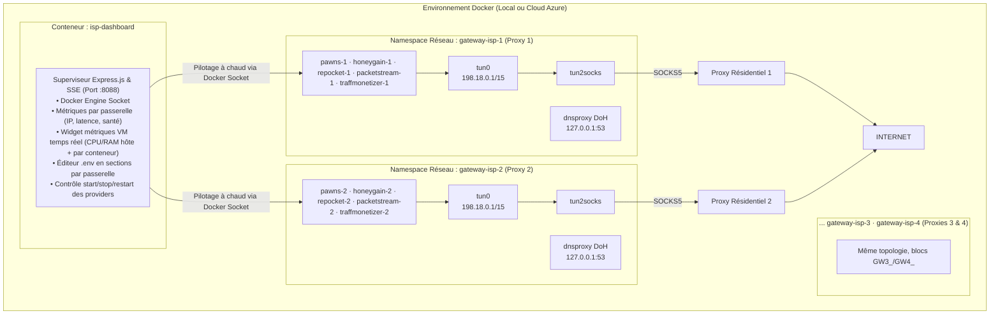

# Multi-Providers Monetization Hub & Multi-Gateways ISP sur Docker

Système automatisé et sécurisé de monétisation de bande passante couplant **jusqu'à 4 passerelles réseau résidentielles / ISP dédiées** (`gateway-isp-1..4`) et **5 fournisseurs de monétisation par passerelle** (TraffMonetizer, Honeygain, PacketStream, Pawns.app, Repocket) au sein d'un environnement Docker isolé avec bascule à chaud, watchdog d'auto-guérison et tableau de bord Web.

---

## 1. Architecture Réseau, Sécurité & Auto-Guérison

L'architecture repose sur l'isolation réseau totale de chaque pool de nœuds grâce au partage d'espace de noms réseau (`network_mode: service:gateway-isp-{n}`). **Chaque passerelle possède son propre namespace** : son propre `tun0`, sa propre table de routage (`0x22b`), son propre résolveur DNS-over-HTTPS (`dnsproxy`) et son propre `tun2socks` vers SON proxy amont — il n'y a **aucun conflit** entre 4 instances (aucun port publié sur l'hôte).



### Points Clés de l'Architecture :
* 🛡️ **Isolation 100% Garantie par passerelle (Kill-Switch / Zéro Fuite)** : le trafic d'un pool ne touche jamais l'IP du serveur hôte ni l'IP d'un autre pool. Si le proxy amont d'une passerelle tombe, **son** trafic est instantanément bloqué (les autres passerelles continuent).
* 🔄 **Watchdog d'Auto-Guérison par passerelle** : chaque gateway-isp détecte ses déconnexions et relance le tunnel (failover ~40s).
* ⚡ **DNS-over-HTTPS (DoH)** par passerelle : prévention absolue des fuites DNS (Cloudflare / Google / Quad9).
* 🌐 **Multi-pools d'IP** : avec `ENABLED_GATEWAYS="1,2,3,4"`, chaque pool dispose de son propre quota de connexions (ex. 4 × 1000 connexions) et de ses propres devices déclarés sur les plateformes (`Device-ISP-1`, `Device-ISP-2`...).
* 🔐 **Dashboard Authentifié** : token (`DASHBOARD_TOKEN`), sessions signées HMAC, CSRF, rate limiting, **CSP stricte** — exposition via tunnel SSH uniquement.
* 📈 **Widget Métriques VM & Pression Noyau (PSI) en Temps Réel** : CPU, RAM, Swap (zRAM) et indicateurs PSI (`/proc/pressure` avec seuils de thrashing) lus directement depuis l'hôte en read-only (sans conteneur sidecar superflu), combinés à la consommation par conteneur (API Docker `stats`) et agrégés via `GET /api/metrics` (cache SWR 5s).

---

## 2. Fournisseurs de Monétisation Supportés

| Fournisseur | Image Docker | Variables Clés (`.env`, par passerelle) | Tableau de Bord | Comportement & Validation en Production |
| :--- | :--- | :--- | :--- | :--- |
| **Pawns.app** | `iproyal/pawns-cli:latest` | `GW{n}_PAWNS_EMAIL`, `GW{n}_PAWNS_PASSWORD`, `GW{n}_PAWNS_DEVICE_NAME` | [pawns.app](https://pawns.app) | 🟢 **Actif** sur 3/4 IP (tarif plein $0.20/GB) ; la 4e IP était en attente de validation plateforme. |
| **Repocket** | `repocket/repocket:latest` | `GW{n}_REPOCKET_EMAIL`, `GW{n}_REPOCKET_API_KEY` | [repocket.com](https://repocket.com) | 🟢 **100% Actif** (4 pairs connectés, 4 IP distinctes, échange de paquets validé). |
| **PacketStream** | `packetstream/psclient:latest` | `GW{n}_PACKETSTREAM_CID` | [packetstream.io](https://packetstream.io) | 🟢 **100% Opérationnel** (tunnels actifs sur les 4 passerelles, trafic comptabilisé). |
| **Honeygain** | `honeygain/honeygain:latest` | `GW{n}_HONEYGAIN_EMAIL`, `GW{n}_HONEYGAIN_PASSWORD`, `GW{n}_HONEYGAIN_DEVICE_NAME` | [dashboard.honeygain.com](https://dashboard.honeygain.com) | 🟢 **Connecté** (4 devices actifs ; conflit de nom temporaire après redémarrage, voir pièges connus). |
| **TraffMonetizer** | `traffmonetizer/cli_v2:latest` (wrapper Alpine `traffmonetizer/`) | `TRAFFMONETIZER_TOKEN` *(global, partagé — un seul token pour les 4 passerelles)*, `GW{n}_TRAFFMONETIZER_DEVICE_NAME` *(défaut `Docker-ISP-{n}-TraffMonetizer`)* | [app.traffmonetizer.com](https://app.traffmonetizer.com) | 🟢 **Actif** (client officiel via wrapper ; un device par passerelle ; remplace EarnFM, qui classait les IP résidentielles comme datacenter → payout réduit). |

---

## 3. Déploiement Cloud sur Microsoft Azure (750h/mois Gratuites)

Le projet est optimisé pour tourner **24h/24 et 7j/7 gratuitement** sur Microsoft Azure.

### Spécifications Recommandées :
* **Instance** : `Standard B2ats_v2` (2 vCPUs AMD EPYC, 1 Go RAM, burstable).
* **Système d'exploitation** : `Debian 13 "Trixie"` x64 (empreinte minimale : ~65 Mo RAM au repos).
* **Consommation mesurée (2026-08, 22 conteneurs optimisés)** : ~300 MiB RSS cumulé pour les conteneurs, ~700-800 MiB mémoire hôte consommée sur 848 MiB (marge ≈130 MiB) — maintenue sous contrôle par la **convergence hôte** (zRAM, quotas, crun, voir ci-dessous) et le suivi temps réel du dashboard. Charge CPU typique < 1 sur 2 vCPU.

### 🚀 Déploiement en 1 Commande sur Azure :
Connectez-vous à votre VM Azure et lancez le script d'initialisation :
```bash
sudo curl -fsSL https://raw.githubusercontent.com/ki2pixel/proxy_docker/main/scripts/azure_cloud_init.sh | sudo bash
```

Ce script configure automatiquement :
1. Swap disque **512 Mo** (filet de secours) puis **convergence hôte** (`./scripts/optimize_vm.sh` : zRAM, crun, daemon.json, earlyoom…) si `OPTIMIZE_VM=1` — **OFF par défaut sur Azure** (VM existante déjà optimisée), ON pour les nouvelles VM (Tierhive).
2. Module noyau `/dev/net/tun` et `CAP_NET_ADMIN`.
3. Installation officielle de Docker CE & Docker Compose.
4. Clonage du projet dans `/opt/proxy_docker` puis démarrage **avec la même logique de profils que `start.sh`** (`ENABLED_GATEWAYS` + `COMPOSE_PROFILES` via `lib.sh`).

### 🌐 Accès au Tableau de Bord (sécurisé) :
Le dashboard n'est **plus exposé publiquement** par défaut (bind `127.0.0.1`, UFW ne ouvre que le port 22). Accédez-y via un tunnel SSH :
```bash
mkdir -p ~/.ssh/sockets   # requis une fois pour le multiplexage SSH
ssh -i docs/Azure/ProxyMonetisation_key.pem -o IdentitiesOnly=yes \
  -o Compression=no \
  -o ControlMaster=auto -o ControlPath=~/.ssh/sockets/%r@%h:%p -o ControlPersist=10m \
  -o ServerAliveInterval=15 -o ServerAliveCountMax=3 \
  -o ExitOnForwardFailure=yes \
  -L 8088:localhost:8088 azureuser@<IP_PUBLIQUE_AZURE>
# puis ouvrez http://localhost:8088 dans votre navigateur
```
> 💡 **Options expliquées** : `Compression no` (le serveur HTTP compresse déjà en Brotli — pas de double encodage), `ControlMaster` (réutilise la connexion pour les ssh/scp suivants), `ServerAlive*` (garder le tunnel vivant derrière le NAT Azure), `ExitOnForwardFailure` (échoue si le port 8088 est déjà pris — détecte un tunnel/conteneur local parasite). Le fichier `cmd_ssh_dashboard.txt` à la racine contient la version complète avec l'alternative `~/.ssh/config`.

Connexion avec le `DASHBOARD_TOKEN` défini dans `.env` (généré avec `openssl rand -hex 32`).

### 🖥️ Gestion multi-VM (Azure + Tierhive) :

Chaque VM héberge sa **propre stack** avec son **propre `.env`** (gitignoré). Sur la machine locale, on garde un fichier par VM :
- `.env` → VM Azure (ex. `68.210.184.174`, user `azureuser`)
- `.env2` → VM Tierhive (ex. `85.155.184.191`, user `root`, port SSH `2755`)

```bash
# Synchroniser vers Azure (comportement historique)
./scripts/sync_env.sh 68.210.184.174 docs/Azure/ProxyMonetisation_key.pem azureuser /opt/proxy_docker

# Synchroniser vers Tierhive (.env2 + port custom + user root) — push-only :
#   on ne fait que pousser le .env, le démarrage est laissé à scripts/start.sh
SSH_PORT=2755 ./scripts/sync_env.sh --push-only 85.155.184.191 docs/Tierhive/ProxyMonetisation1.txt root /opt/proxy_docker .env2
```

> **Nouvelle VM (recommandé)** : passez `--push-only` — `sync_env.sh` pousse alors le `.env` **sans** lancer `docker compose up`. Le démarrage complet (construction des images locales + profils + healthchecks) revient à `./scripts/start.sh` : évite un double `up` avec le compte rendu de `sync_env.sh`.

> ⚠️ **Avant de déployer sur une 2e VM** : renommez les devices (`GW{n}_DEVICE_NAME`, `GW{n}_HONEYGAIN_DEVICE_NAME`, `GW{n}_PAWNS_DEVICE_NAME`) pour éviter les conflits de noms côté plateformes, laissez les `GW{n}_UUID` vides (auto-génération) et utilisez des **IP proxy amont différentes** — les monetiseurs rejettent des devices tournant sur les mêmes IP. Le script refuse de synchroniser un fichier contenant des `CHANGEME_` (garde-fou).

### 💾 Override compose pour petites VM (1 vCPU / 1 Go) :

Le fichier [`docker-compose.override.yml`](docker-compose.override.yml) applique les **mêmes quotas que la base** (passerelles 64m/0.40cpu/128 pids, providers 96m/0.25cpu/64 pids) : il garantit qu'une VM Tierhive — ou toute VM dont la copie du dépôt serait antérieure — reçoit les plafonds optimisés. Il est **chargé automatiquement** par `docker compose up` (et par le dashboard via le controller) dès qu'il est présent dans le répertoire.

- **Sûr sur Azure** : valeurs identiques à la base `docker-compose.yml` — aucun effet de bord.
- Sur Tierhive, le **swap disque 512 Mo + zRAM** sont posés par le cloud-init via `optimize_vm.sh` (pas de swap par défaut sur cette plateforme).

### ⚡ Convergence hôte : optimisations mémoire pour petites VM

Le script [`scripts/optimize_vm.sh`](scripts/optimize_vm.sh) applique (idempotent, `--dry-run` supporté) le socle hôte qui évite le **swap-thrash** observé en production sur Azure :

* **zRAM** : swap compressé en RAM (zstd, taille = RAM, priorité 100) — plus aucun thrash disque sous pression mémoire.
* **Swap disque 512 Mo** en filet de secours (priorité -2) + sysctl (`vm.swappiness=100`, `page-cluster=0`, `vfs_cache_pressure=50`).
* **earlyoom** : purge préventive des providers avant OOM global (protège `sshd`/`dockerd`/`containerd`).
* **`/etc/docker/daemon.json`** : runtime **crun** (OCI C, plus léger au démarrage), log driver `local` (2m×2 compressé), `live-restore`, `userland-proxy:false`, `ip6tables:false`, `no-new-privileges`.
* **Overrides systemd** pour dockerd/containerd : `GOMEMLIMIT`/`GOGC` + bornes cgroup v2 (`MemoryMin/Low/Max`).

Appelé par les cloud-init via la bascule `OPTIMIZE_VM` (`1` = actif, `0` = ignoré). Voir le [rapport de recherche](docs/Recherches/Optimisation_Docker_VM_1_Go.md) qui en est la source.

### 🔐 Exposition publique optionnelle (TLS via Caddy) :
Si vous voulez un accès public chiffré, ajoutez le profil `tls` **en plus** de vos profils actuels :
```bash
# .env — ex: repocket + tls
COMPOSE_PROFILES="repocket,tls"
DASHBOARD_DOMAIN="dashboard.example.com"
```
```bash
docker compose -p proxy_docker --profile tls up -d caddy
```
Caddy obtient automatiquement un certificat Let's Encrypt pour `DASHBOARD_DOMAIN`.

### ✏️ Éditeur de Configuration intégré :
Le dashboard permet de **modifier le `.env` directement** (section "Configuration de la Stack"), sans SSH :
* Champs groupés en **sections repliables** : `Global` (dashboard, loglevel), `Passerelle 1..4` (proxy + 5 providers chacune), `Clés héritées` (anciennes clés mono-passerelle, conservées pour la migration) avec badge du schéma de proxy actif (classique).
* Les mots de passe et clés API sont **masqués** (impossible de les lire ou de les écraser par accident — champ vide = inchangé).
* Bouton **"Enregistrer"** (écrit le `.env`) ou **"Enregistrer & Appliquer"** (écrit + `docker compose up -d` avec confirmation).
* Seules les clés connues sont éditables (allowlist) — pas de mode fichier brut.

> ⚠️ Le `.env` reste gitignoré : un commit ne l'écrase jamais sur la VM. L'éditeur du dashboard et `sync_env.sh` modifient le même fichier — faites attention à ne pas écraser des changements faits de l'autre côté.

### 📈 Suivi des métriques VM (CPU / RAM / Swap / PSI) en temps réel

Le dashboard intègre une section **« Performance de la VM »** qui affiche en direct la consommation et la contention de la machine :

* **Carte hôte** : CPU, RAM et Swap (zRAM) lus directement depuis `/proc` monté en read-only sur le conteneur du dashboard — sans conteneur sidecar superflu.
* **Carte Pression Noyau (PSI — Pressure Stall Information)** : métriques de saturation du noyau (`/proc/pressure/memory`, `cpu`, `io`) avec badge de statut d'intégrité et **détection proactive du thrashing** (`full memory avg10 >= 15%`).
* **Table par conteneur** : CPU/RAM de chaque passerelle et provider, calculés via l'API Docker `stats` (delta `precpu_stats`).
* **Agrégation** : route `GET /api/metrics` (sous authentification) avec **cache SWR 5s** — mêmes mécanismes que `/api/status` (réponse instantanée, polling client adaptatif).
* **Surveillance proactive** : la fenêtre d'observation des métriques Azure Monitor est croisée avec les logs système pour identifier les pics (voir la [post-analyse détaillée](docs/Azure/Post_Analyse_Metriques_VM.md)).

> ⚙️ *Fonctionnement* : le dashboard lit `/host/proc` (ou `/proc` en dev) et les stats Docker à chaque cycle ; si une ressource est indisponible, le widget s'adapte sans bloquer le reste du tableau de bord.

### 🧠 Pièges connus & bonnes pratiques (retour d'expérience production)

* **Honeygain — conflit de noms après redémarrage** : si un conteneur Honeygain redémarre (CI, restart), Honeygain refuse le device avec `Device with this name is already active` tant que l'ancienne session n'a pas expiré (quelques minutes). C'est temporaire et auto-résorbable — les devices repassent actifs d'eux-mêmes. Les noms `Docker-ISP-{1..4}-Honeygain` sont distincts et corrects.
* **Validation IP par les plateformes** : Pawns et Honeygain peuvent **rejeter temporairement une nouvelle IP** (`tcpip-forward denied` / `Network Unusable`) alors que la passerelle est saine et que les autres providers (Repocket, PacketStream, TraffMonetizer) y sont actifs. C'est un délai de validation plateforme (souvent quelques heures), pas un bug de la stack.
* **Port 8088 local** : si le dashboard affiche une **ancienne version** en navigation privée, c'est qu'un **ancien conteneur Docker local** (ou un ancien tunnel) occupe le port 8088 et sert une vieille image — pas la VM. Vérifiez `docker ps` / `ss -tlnp | grep 8088` et arrêtez la stack locale (`docker compose -p proxy_docker down`) pour libérer le port vers le tunnel SSH.
* **Frontend périmé après redéploiement** : les assets sont désormais **hashés par contenu** (`app.<hash>.js` servis avec `max-age=1y, immutable`) — un redéploiement change le hash et le navigateur recharge automatiquement la nouvelle version. Si une page semble encore figée après un push, faites un **hard reload** (`Ctrl+Shift+R`) une fois ; l'`index.html` lui reste en revalidation (ETag).

---

## 4. Démarrage Rapide en Local

### Prérequis
* Docker Engine 20.10+ et Docker Compose v2+
* Noyau Linux avec module TUN actif (`/dev/net/tun`).

### Étape 1 : Configuration (`.env`)
```bash
cp .env.example .env
```

Éditez le fichier `.env` pour renseigner vos identifiants :
```ini
# Port du tableau de bord Web (localhost uniquement)
DASHBOARD_PORT=8088

# 🔐 OBLIGATOIRE — générez avec : openssl rand -hex 32
DASHBOARD_TOKEN="votre_token_connexion_dashboard"
DASHBOARD_SECRET="votre_secret_hmac_session"

# Passerelles actives : "1" | "1,2" | "1,2,3" | "1,2,3,4"
ENABLED_GATEWAYS="1"

# Fournisseurs actifs : none | traffmonetizer | honeygain | packetstream | pawns | repocket | all
# "none" = aucun provider (seules les passerelles et le dashboard tournent)
COMPOSE_PROFILES="all"

# --- Passerelle 1 (fallback clés historiques ISP_PROXY_*) ---
GW1_ISP_PROXY_PROTOCOL="socks5"
GW1_ISP_PROXY_HOST="CHANGEME_proxy1.example.com"
GW1_ISP_PROXY_PORT="1080"
GW1_ISP_PROXY_USER="votre_identifiant_session"
GW1_ISP_PROXY_PASS="votre_mot_de_passe"
# ... et les identifiants GW1_* de chaque fournisseur (pawns, honeygain, ...)

# --- Passerelles 2, 3, 4 : mêmes clés préfixées GW2_/GW3_/GW4_ ---
# Chaque passerelle = 1 proxy amont distinct = 1 pool d'IP = 1 quota de connexions.

# --- Global (appliqué à toutes les passerelles) ---
GATEWAY_LOGLEVEL="warn"
```
> ⚠️ Les anciennes clés (`ISP_PROXY_HOST`, `PAWNS_EMAIL`, ...) restent **acceptées** : elles servent de fallback pour la passerelle 1 (migration sans casse). Le dashboard continue de les afficher (section "Clés héritées").
> ⚠️ Le démarrage est refusé si des valeurs placeholder (`CHANGEME_*`) restent dans le `.env`.

### Étape 2 : Lancement
```bash
./scripts/start.sh
```
Ou directement (les profils sont construits d'après `ENABLED_GATEWAYS` et `COMPOSE_PROFILES`) :
```bash
# 1 passerelle + tous les fournisseurs :
docker compose --profile gw1 --profile gw1-pawns --profile gw1-honeygain --profile gw1-repocket --profile gw1-packetstream --profile gw1-traffmonetizer up -d --build
# 4 passerelles + tous les fournisseurs :
docker compose --profile gw1 --profile gw2 --profile gw3 --profile gw4 --profile all up -d --build
```
> 💡 `./scripts/start.sh` construit ces profils automatiquement depuis `ENABLED_GATEWAYS` + `COMPOSE_PROFILES` — c'est la méthode recommandée.

Tableau de bord Web : **[http://localhost:8088](http://localhost:8088)** — connexion avec le `DASHBOARD_TOKEN` (page de login).

---

## 5. Scripts Utilitaires & Automatisation

| Script | Description |
| :--- | :--- |
| [`scripts/sync_env.sh`](scripts/sync_env.sh) | **Synchronise un `.env` local vers la VM** : `./scripts/sync_env.sh <IP> <CHEMIN_CLE> [user] [APP_DIR] [ENV_SOURCE] [--push-only]`. `ENV_SOURCE` (défaut `.env`) permet de gérer **plusieurs VM** : `.env` pour Azure, `.env2` pour Tierhive. `--push-only` pousse le `.env` sans lancer `docker compose up` (recommandé pour une nouvelle VM — lancez ensuite `start.sh`). Prérequis : serveur dans `known_hosts` (`ssh-keyscan -H <IP> >> ~/.ssh/known_hosts`), port custom via `SSH_PORT` (ex. `SSH_PORT=2755` pour Tierhive). ⚠️ Écrase le `.env` distant (confirmation requise) ; refuse les fichiers contenant des `CHANGEME_`. |
| [`scripts/azure_cloud_init.sh`](scripts/azure_cloud_init.sh) | Script cloud-init pour VM Azure Debian 13 : swap 512 Mo, TUN, Docker, clonage du repo puis démarrage **avec la logique de profils de `start.sh`** (`ENABLED_GATEWAYS` + `COMPOSE_PROFILES` via `lib.sh`). Convergence hôte via `optimize_vm.sh` si `OPTIMIZE_VM=1` (OFF par défaut sur Azure — déjà optimisée). |
| [`scripts/tierhive_cloud_init.sh`](scripts/tierhive_cloud_init.sh) | Script cloud-init pour VM **Tierhive** (KVM, 1 vCPU/1 Go) : swap 512 Mo, TUN, Docker, UFW sur SSH 2755, **convergence hôte activée par défaut** (`OPTIMIZE_VM=1` → zRAM, crun, earlyoom). Ne crée pas de `.env` (synchronisation via `sync_env.sh`). |
| [`scripts/optimize_vm.sh`](scripts/optimize_vm.sh) | **Convergence hôte pour petites VM** (idempotent, `--dry-run`) : zRAM (swap compressé en RAM, priorité 100), swap disque 512 Mo (filet de secours), sysctl (`swappiness=100`, `page-cluster=0`, `vfs_cache_pressure=50`), earlyoom (anti-OOM), `/etc/docker/daemon.json` (runtime `crun`, log driver `local`, `live-restore`, `userland-proxy:false`, `ip6tables:false`, `no-new-privileges`) et overrides systemd `GOMEMLIMIT`/`GOGC` pour dockerd/containerd. Appelé par les cloud-init via `OPTIMIZE_VM`. |
| [`scripts/digitalocean_cloud_init.sh`](scripts/digitalocean_cloud_init.sh) | Script cloud-init pour DigitalOcean Droplet. |
| [`scripts/vultr_cloud_init.sh`](scripts/vultr_cloud_init.sh) | Script cloud-init pour Vultr Cloud Compute. |
| [`scripts/rotate_env.sh`](scripts/rotate_env.sh) | **Rotation de tous les secrets** du `.env` (génère de nouvelles valeurs + guide). |
| [`scripts/status.sh`](scripts/status.sh) | Affiche l'état complet des conteneurs, le statut de **chaque passerelle** et la géolocalisation de chaque IP. |
| [`scripts/switch_isp_proxy.sh`](scripts/switch_isp_proxy.sh) | Bascule à chaud le proxy amont d'une passerelle : `./scripts/switch_isp_proxy.sh <HOST:PORT[:USER:PASS]> [socks5|http] [gateway]` (défaut gateway 1). |
| [`scripts/switch_provider.sh`](scripts/switch_provider.sh) | Bascule le fournisseur de monétisation actif (`none` = aucun provider) sur **toutes les passerelles actives**. |
| [`scripts/test_proxy.sh`](scripts/test_proxy.sh) | Teste la connectivité du proxy amont (via le conteneur gateway-isp-{n} par défaut, `[gateway]` en 3e argument). |
| [`scripts/benchmark.sh`](scripts/benchmark.sh) | Lance un benchmark en temps réel mesurant la RAM, le CPU et les PIDs de la stack. |
| [`scripts/build-assets.mjs`](scripts/build-assets.mjs) | **Génère les assets versionnés** (cache-busting) : hache `app.js`/`style.css`/`fonts.css` dans `controller/public/dist/` et réécrit les références dans `index.html` (idempotent : refs hashées ou non). Lancé par `start.sh` et le CI avant chaque build. |

---

## 6. Déploiement Continu (CI/CD GitHub Actions)

Le fichier [`.github/workflows/deploy.yml`](.github/workflows/deploy.yml) déploie automatiquement chaque mise à jour sur votre VM Azure lors d'un `git push origin main` :
1. Validation de `docker compose config` (locale, avec les profils `gw1` + les 5 types).
2. `git fetch && reset --hard origin/main` sur la VM, puis **génération des assets versionnés** (`node scripts/build-assets.mjs`, fallback sur les fichiers `dist/` commités si `node` est absent), puis `docker compose up -d --build --force-recreate --remove-orphans` avec les profils construits d'après `ENABLED_GATEWAYS` + `COMPOSE_PROFILES` du `.env` de la VM. S'ensuit une **recréation ciblée des providers par noms** (`network_mode: service:`) : compose ne ré-attache pas fiablement ces services à une passerelle fraîchement recréée lors d'un `--force-recreate` global — sans cette passe, ils resteraient dans le namespace réseau orphelin de l'ancienne passerelle (DNS local mort, devices marqués inactifs par les plateformes).
3. Attente du healthcheck du dashboard (max 90s) avant de déclarer le succès ; la santé des gateways est signalée sans bloquer (elle dépend des proxies amonts, pas du code).
4. Nettoyage des images de plus de 72h uniquement.

> ⚠️ Chaque déploiement CI **recrée tous les conteneurs** : les devices Honeygain peuvent être temporairement rejetés (`Device with this name is already active`) pendant quelques minutes — c'est normal et auto-résorbable (voir pièges connus).

Le pipeline [`.github/workflows/security.yml`](.github/workflows/security.yml) scanne chaque push/PR : **gitleaks** (secrets), **shellcheck** (scripts bash) et **npm audit + tests** (controller).

### Configuration des Secrets GitHub :
Dans votre dépôt GitHub (***Settings ➔ Secrets and variables ➔ Actions***), ajoutez :
* `AZURE_HOST_IP` : L'adresse IP publique de votre VM Azure.
* `AZURE_SSH_KEY` : Le contenu intégral de votre **clé privée SSH** (stockée dans un gestionnaire de secrets, jamais dans le dépôt).
* `AZURE_USERNAME` *(optionnel)* : `azureuser` (par défaut).

> ⚠️ **Ne commitez jamais** une clé privée, un `.env` ou un `.pem` dans le dépôt. Un pipeline `gitleaks` (`.github/workflows/security.yml`) scanne chaque push.

---

## 7. Documentation Technique Approfondie

* 📄 [Évaluation Déploiement Stack Docker sur Azure](docs/Recherches/Évaluation_Stack_Docker_sur_Azure.md) : Analyse Hyper-V, TUN/TAP, dimensionnement VM série B, quotas de bande passante et sécurité.
* 📄 [Guide d'Intégration Passerelle ISP / Static Residential](docs/Integration_Passerelle_ISP_Residential.md) : Comparatif des fournisseurs de proxys et guide d'optimisation.
* 📄 [Multi-Passerelles : 4 Pools d'IP](docs/Multi_Gateways_4_Proxies.md) : Dimensionnement, déploiement multi-proxys, profils compose et migration.
* 📄 [Rapport de Recherche sur le Routage Docker](docs/Recherches/Routage_Docker_Monétisation_Bande_Passante.md) : Analyse des solutions Dongle 4G, VPN Dédiés et Proxies ISP.
* 📄 [Optimisation Performance Web & Tunnel SSH](docs/Recherches/Optimisation_Performance_Web_et_Tunnel.md) : Audit de performance du dashboard derrière un tunnel transatlantique — SWR, compression Brotli, cache-busting, polices self-hosted, polling adaptatif, réglages SSH.
* 📄 [Post-Analyse des Métriques VM Azure](docs/Azure/Post_Analyse_Metriques_VM.md) : Analyse d'un pic CPU/RAM observé sur Azure Monitor (06:39) — cause racine (conteneur orphelin en crash-loop), pression mémoire chronique (swap) et perspectives d'optimisation de la stack.
* 📄 [Optimisation Docker sur VM 1 Go](docs/Recherches/Optimisation_Docker_VM_1_Go.md) : Étude deep search (Gemini) sur l'effondrement swap-thrash Azure — zRAM, runtime crun, quotas cgroup v2, earlyoom — dont découle `scripts/optimize_vm.sh` (retour d'expérience applicatif détaillé dans ce dépôt).
