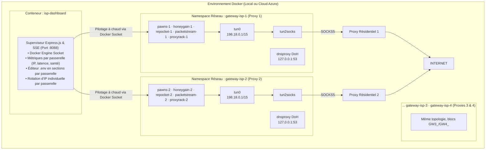

# Multi-Providers Monetization Hub & Multi-Gateways ISP sur Docker

Système automatisé et sécurisé de monétisation de bande passante couplant **jusqu'à 4 passerelles réseau résidentielles / ISP dédiées** (`gateway-isp-1..4`) et **5 fournisseurs de monétisation par passerelle** (Proxyrack, Honeygain, PacketStream, Pawns.app, Repocket) au sein d'un environnement Docker isolé avec bascule à chaud, watchdog d'auto-guérison et tableau de bord Web.

---

## 1. Architecture Réseau, Sécurité & Auto-Guérison

L'architecture repose sur l'isolation réseau totale de chaque pool de nœuds grâce au partage d'espace de noms réseau (`network_mode: service:gateway-isp-{n}`). **Chaque passerelle possède son propre namespace** : son propre `tun0`, sa propre table de routage (`0x22b`), son propre résolveur DNS-over-HTTPS (`dnsproxy`) et son propre `tun2socks` vers SON proxy amont — il n'y a **aucun conflit** entre 4 instances (aucun port publié sur l'hôte).



### Points Clés de l'Architecture :
* 🛡️ **Isolation 100% Garantie par passerelle (Kill-Switch / Zéro Fuite)** : le trafic d'un pool ne touche jamais l'IP du serveur hôte ni l'IP d'un autre pool. Si le proxy amont d'une passerelle tombe, **son** trafic est instantanément bloqué (les autres passerelles continuent).
* 🔄 **Watchdog d'Auto-Guérison par passerelle** : chaque gateway-isp détecte ses déconnexions et génère une nouvelle session active (failover ~40s).
* ⏰ **Rotation Préventive par passerelle (50 min)** : déclenchée par le controller pour chaque passerelle dont le proxy est en mode session résidentielle (`session-`).
* ⚡ **DNS-over-HTTPS (DoH)** par passerelle : prévention absolue des fuites DNS (Cloudflare / Google / Quad9).
* 🌐 **Multi-pools d'IP** : avec `ENABLED_GATEWAYS="1,2,3,4"`, chaque pool dispose de son propre quota de connexions (ex. 4 × 1000 connexions) et de ses propres devices déclarés sur les plateformes (`Device-ISP-1`, `Device-ISP-2`...).
* 🔐 **Dashboard Authentifié** : token (`DASHBOARD_TOKEN`), sessions signées HMAC, CSRF, rate limiting, **CSP stricte** — exposition via tunnel SSH uniquement.
* 📊 **Tableau de Bord & API en Temps Réel** : état individuel de chaque passerelle (IP, géolocalisation, latence, santé), nœuds par passerelle, logs SSE + polling 5s par conteneur, édition `.env` en sections repliables par passerelle.

---

## 2. Fournisseurs de Monétisation Supportés

| Fournisseur | Image Docker | Variables Clés (`.env`, par passerelle) | Tableau de Bord | Comportement & Validation en Production |
| :--- | :--- | :--- | :--- | :--- |
| **Pawns.app** | `iproyal/pawns-cli:latest` | `GW{n}_PAWNS_EMAIL`, `GW{n}_PAWNS_PASSWORD`, `GW{n}_PAWNS_DEVICE_NAME` | [pawns.app](https://pawns.app) | 🟢 **Actif** sur 3/4 IP (tarif plein $0.20/GB) ; la 4e IP était en attente de validation plateforme. |
| **Repocket** | `repocket/repocket:latest` | `GW{n}_REPOCKET_EMAIL`, `GW{n}_REPOCKET_API_KEY` | [repocket.com](https://repocket.com) | 🟢 **100% Actif** (4 pairs connectés, 4 IP distinctes, échange de paquets validé). |
| **PacketStream** | `packetstream/psclient:latest` | `GW{n}_PACKETSTREAM_CID` | [packetstream.io](https://packetstream.io) | 🟢 **100% Opérationnel** (tunnels actifs sur les 4 passerelles, trafic comptabilisé). |
| **Honeygain** | `honeygain/honeygain:latest` | `GW{n}_HONEYGAIN_EMAIL`, `GW{n}_HONEYGAIN_PASSWORD`, `GW{n}_HONEYGAIN_DEVICE_NAME` | [dashboard.honeygain.com](https://dashboard.honeygain.com) | 🟢 **Connecté** (4 devices actifs ; conflit de nom temporaire après redémarrage, voir pièges connus). |
| **Proxyrack** | `./proxyrack/Dockerfile` | `GW{n}_API_KEY`, `GW{n}_DEVICE_NAME`, `GW{n}_UUID` *(laisser vide = auto-généré)* | [peer.proxyrack.com](https://peer.proxyrack.com) | 🟢 **Connecté** (4 devices enregistrés avec UUID distincts par volume). |

---

## 3. Déploiement Cloud sur Microsoft Azure (750h/mois Gratuites)

Le projet est optimisé pour tourner **24h/24 et 7j/7 gratuitement** sur Microsoft Azure.

### Spécifications Recommandées :
* **Instance** : `Standard B2ats_v2` (2 vCPUs AMD EPYC, 1 Go RAM, burstable).
* **Système d'exploitation** : `Debian 13 "Trixie"` x64 (empreinte minimale : ~65 Mo RAM au repos).
* **Consommation mesurée de la stack** : **106,7 MiB RAM** et **8,46% CPU** *(très en dessous de la ligne de base de 20% CPU, accumulant continuellement des crédits processeur)*.

### 🚀 Déploiement en 1 Commande sur Azure :
Connectez-vous à votre VM Azure et lancez le script d'initialisation :
```bash
sudo curl -fsSL https://raw.githubusercontent.com/ki2pixel/proxy_docker/main/scripts/azure_cloud_init.sh | sudo bash
```

Ce script configure automatiquement :
1. Fichier de Swap SSD de 1 Go.
2. Module noyau `/dev/net/tun` et `CAP_NET_ADMIN`.
3. Installation officielle de Docker CE & Docker Compose.
4. Clonage du projet dans `/opt/proxy_docker` et démarrage automatique.

### 🌐 Accès au Tableau de Bord (sécurisé) :
Le dashboard n'est **plus exposé publiquement** par défaut (bind `127.0.0.1`, UFW ne ouvre que le port 22). Accédez-y via un tunnel SSH :
```bash
ssh -L 8088:localhost:8088 azureuser@<IP_PUBLIQUE_AZURE>
# puis ouvrez http://localhost:8088 dans votre navigateur
```

Connexion avec le `DASHBOARD_TOKEN` défini dans `.env` (généré avec `openssl rand -hex 32`).

### 🔐 Exposition publique optionnelle (TLS via Caddy) :
Si vous voulez un accès public chiffré, ajoutez le profil `tls` **en plus** de vos profils actuels :
```bash
# .env — ex: repocket + tls
COMPOSE_PROFILES="repocket,tls"
DASHBOARD_DOMAIN="dashboard.example.com"
```
```bash
docker compose -p proxy_docker --profile tls up -d caddy
```
Caddy obtient automatiquement un certificat Let's Encrypt pour `DASHBOARD_DOMAIN`.

### ✏️ Éditeur de Configuration intégré :
Le dashboard permet de **modifier le `.env` directement** (section "Configuration de la Stack"), sans SSH :
* Champs groupés en **sections repliables** : `Global` (dashboard, rotation, loglevel), `Passerelle 1..4` (proxy + 5 providers chacune), `Clés héritées` (anciennes clés mono-passerelle, conservées pour la migration) avec badge du schéma de proxy actif (session résidentielle vs classique).
* Les mots de passe et clés API sont **masqués** (impossible de les lire ou de les écraser par accident — champ vide = inchangé).
* Bouton **"Enregistrer"** (écrit le `.env`) ou **"Enregistrer & Appliquer"** (écrit + `docker compose up -d` avec confirmation).
* Seules les clés connues sont éditables (allowlist) — pas de mode fichier brut.

> ⚠️ Le `.env` reste gitignoré : un commit ne l'écrase jamais sur la VM. L'éditeur du dashboard et `sync_env.sh` modifient le même fichier — faites attention à ne pas écraser des changements faits de l'autre côté.

### 🧠 Pièges connus & bonnes pratiques (retour d'expérience production)

* **Proxyrack — UUID par passerelle** : chaque passerelle a son volume (`proxyrack_data_{1..4}`) et son device. Laissez `GW{n}_UUID` **vide** pour que chaque conteneur génère son propre UUID aléatoire persistant (nécessaire pour 4 devices distincts). Un UUID identique sur plusieurs passerelles = un seul device enregistré. Après avoir vidé l'UUID, recréez le conteneur (`docker compose up -d --force-recreate proxyrack-{n}`) et supprimez `uuid.txt`/`api.cfg` du volume si besoin.
* **Honeygain — conflit de noms après redémarrage** : si un conteneur Honeygain redémarre (CI, restart), Honeygain refuse le device avec `Device with this name is already active` tant que l'ancienne session n'a pas expiré (quelques minutes). C'est temporaire et auto-résorbable — les devices repassent actifs d'eux-mêmes. Les noms `Docker-ISP-{1..4}-Honeygain` sont distincts et corrects.
* **Validation IP par les plateformes** : Pawns et Honeygain peuvent **rejeter temporairement une nouvelle IP** (`tcpip-forward denied` / `Network Unusable`) alors que la passerelle est saine et que les autres providers (Repocket, PacketStream, Proxyrack) y sont actifs. C'est un délai de validation plateforme (souvent quelques heures), pas un bug de la stack.
* **Port 8088 local** : si le dashboard affiche une **ancienne version** en navigation privée, c'est qu'un **ancien conteneur Docker local** (ou un ancien tunnel) occupe le port 8088 et sert une vieille image — pas la VM. Vérifiez `docker ps` / `ss -tlnp | grep 8088` et arrêtez la stack locale (`docker compose -p proxy_docker down`) pour libérer le port vers le tunnel SSH.
* **Rate limit API** : l'API Proxyrack (`/api/device/add`) limite à 5 requêtes/min. Avec 3 conteneurs qui s'enregistrent simultanément, les retries se télescopent — les devices finissent par s'enregistrer (ou le faire manuellement, espacé de 20s).

---

## 4. Démarrage Rapide en Local

### Prérequis
* Docker Engine 20.10+ et Docker Compose v2+
* Noyau Linux avec module TUN actif (`/dev/net/tun`).

### Étape 1 : Configuration (`.env`)
```bash
cp .env.example .env
```

Éditez le fichier `.env` pour renseigner vos identifiants :
```ini
# Port du tableau de bord Web (localhost uniquement)
DASHBOARD_PORT=8088

# 🔐 OBLIGATOIRE — générez avec : openssl rand -hex 32
DASHBOARD_TOKEN="votre_token_connexion_dashboard"
DASHBOARD_SECRET="votre_secret_hmac_session"

# Passerelles actives : "1" | "1,2" | "1,2,3" | "1,2,3,4"
ENABLED_GATEWAYS="1"

# Fournisseurs actifs : none | proxyrack | honeygain | packetstream | pawns | repocket | all
# "none" = aucun provider (seules les passerelles et le dashboard tournent)
COMPOSE_PROFILES="all"

# --- Passerelle 1 (fallback clés historiques ISP_PROXY_*) ---
GW1_ISP_PROXY_PROTOCOL="socks5"
GW1_ISP_PROXY_HOST="proxy.flameproxies.com"
GW1_ISP_PROXY_PORT="1080"
GW1_ISP_PROXY_USER="votre_identifiant_session"
GW1_ISP_PROXY_PASS="votre_mot_de_passe"
# ... et les identifiants GW1_* de chaque fournisseur (pawns, honeygain, ...)

# --- Passerelles 2, 3, 4 : mêmes clés préfixées GW2_/GW3_/GW4_ ---
# Chaque passerelle = 1 proxy amont distinct = 1 pool d'IP = 1 quota de connexions.

# --- Global (appliqué à toutes les passerelles) ---
GATEWAY_LOGLEVEL="warn"
AUTO_ROTATE_SESSION="true"
AUTO_ROTATE_INTERVAL="50"
```
> ⚠️ Les anciennes clés (`ISP_PROXY_HOST`, `PAWNS_EMAIL`, ...) restent **acceptées** : elles servent de fallback pour la passerelle 1 (migration sans casse). Le dashboard continue de les afficher (section "Clés héritées").
> ⚠️ Le démarrage est refusé si des valeurs placeholder (`CHANGEME_*`) restent dans le `.env`.

### Étape 2 : Lancement
```bash
./scripts/start.sh
```
Ou directement (les profils sont construits d'après `ENABLED_GATEWAYS` et `COMPOSE_PROFILES`) :
```bash
# 1 passerelle + tous les fournisseurs :
docker compose --profile gw1 --profile gw1-pawns --profile gw1-honeygain --profile gw1-repocket --profile gw1-packetstream --profile gw1-proxyrack up -d --build
# 4 passerelles + tous les fournisseurs :
docker compose --profile gw1 --profile gw2 --profile gw3 --profile gw4 --profile all up -d --build
```
> 💡 `./scripts/start.sh` construit ces profils automatiquement depuis `ENABLED_GATEWAYS` + `COMPOSE_PROFILES` — c'est la méthode recommandée.

Tableau de bord Web : **[http://localhost:8088](http://localhost:8088)** — connexion avec le `DASHBOARD_TOKEN` (page de login).

---

## 5. Scripts Utilitaires & Automatisation

| Script | Description |
| :--- | :--- |
| [`scripts/sync_env.sh`](scripts/sync_env.sh) | **Synchronise le `.env` local vers la VM** : `./scripts/sync_env.sh <IP> <CHEMIN_CLE> [user] [APP_DIR]`. Prérequis : serveur dans `known_hosts` (`ssh-keyscan -H <IP> >> ~/.ssh/known_hosts`), port custom via `SSH_PORT`. ⚠️ Écrase le .env distant (confirmation requise). |
| [`scripts/azure_cloud_init.sh`](scripts/azure_cloud_init.sh) | Script cloud-init d'installation automatique pour VM Azure Debian 13. |
| [`scripts/digitalocean_cloud_init.sh`](scripts/digitalocean_cloud_init.sh) | Script cloud-init pour DigitalOcean Droplet. |
| [`scripts/vultr_cloud_init.sh`](scripts/vultr_cloud_init.sh) | Script cloud-init pour Vultr Cloud Compute. |
| [`scripts/rotate_ip.sh`](scripts/rotate_ip.sh) | Déclenche une rotation manuelle immédiate de la session résidentielle. Usage : `./scripts/rotate_ip.sh [gateway]` (défaut : toutes les passerelles actives). |
| [`scripts/rotate_env.sh`](scripts/rotate_env.sh) | **Rotation de tous les secrets** du `.env` (génère de nouvelles valeurs + guide). |
| [`scripts/status.sh`](scripts/status.sh) | Affiche l'état complet des conteneurs, le statut de **chaque passerelle** et la géolocalisation de chaque IP. |
| [`scripts/switch_isp_proxy.sh`](scripts/switch_isp_proxy.sh) | Bascule à chaud le proxy amont d'une passerelle : `./scripts/switch_isp_proxy.sh <HOST:PORT[:USER:PASS]> [socks5|http] [gateway]` (défaut gateway 1). |
| [`scripts/switch_provider.sh`](scripts/switch_provider.sh) | Bascule le fournisseur de monétisation actif (`none` = aucun provider) sur **toutes les passerelles actives**. |
| [`scripts/test_proxy.sh`](scripts/test_proxy.sh) | Teste la connectivité du proxy amont (via le conteneur gateway-isp-{n} par défaut, `[gateway]` en 3e argument). |
| [`scripts/benchmark.sh`](scripts/benchmark.sh) | Lance un benchmark en temps réel mesurant la RAM, le CPU et les PIDs de la stack. |

---

## 6. Déploiement Continu (CI/CD GitHub Actions)

Le fichier [`.github/workflows/deploy.yml`](.github/workflows/deploy.yml) déploie automatiquement chaque mise à jour sur votre VM Azure lors d'un `git push origin main` :
1. Validation de `docker compose config` (locale, avec les profils `gw1` + les 5 types).
2. `git fetch && reset --hard origin/main` sur la VM, puis `docker compose up -d --build --remove-orphans` avec les profils construits d'après `ENABLED_GATEWAYS` + `COMPOSE_PROFILES` du `.env` de la VM (sans down destructeur).
3. Attente du healthcheck du dashboard (max 90s) avant de déclarer le succès ; la santé des gateways est signalée sans bloquer (elle dépend des proxies amonts, pas du code).
4. Nettoyage des images de plus de 72h uniquement.

> ⚠️ Chaque déploiement CI **recrée tous les conteneurs** : les devices Honeygain peuvent être temporairement rejetés (`Device with this name is already active`) pendant quelques minutes — c'est normal et auto-résorbable (voir pièges connus).

Le pipeline [`.github/workflows/security.yml`](.github/workflows/security.yml) scanne chaque push/PR : **gitleaks** (secrets), **shellcheck** (scripts bash) et **npm audit + tests** (controller).

### Configuration des Secrets GitHub :
Dans votre dépôt GitHub (***Settings ➔ Secrets and variables ➔ Actions***), ajoutez :
* `AZURE_HOST_IP` : L'adresse IP publique de votre VM Azure.
* `AZURE_SSH_KEY` : Le contenu intégral de votre **clé privée SSH** (stockée dans un gestionnaire de secrets, jamais dans le dépôt).
* `AZURE_USERNAME` *(optionnel)* : `azureuser` (par défaut).

> ⚠️ **Ne commitez jamais** une clé privée, un `.env` ou un `.pem` dans le dépôt. Un pipeline `gitleaks` (`.github/workflows/security.yml`) scanne chaque push.

---

## 7. Documentation Technique Approfondie

* 📄 [Évaluation Déploiement Stack Docker sur Azure](docs/Recherches/Évaluation_Stack_Docker_sur_Azure.md) : Analyse Hyper-V, TUN/TAP, dimensionnement VM série B, quotas de bande passante et sécurité.
* 📄 [Guide d'Intégration Passerelle ISP / Static Residential](docs/Integration_Passerelle_ISP_Residential.md) : Comparatif des fournisseurs de proxys et guide d'optimisation.
* 📄 [Multi-Passerelles : 4 Pools d'IP](docs/Multi_Gateways_4_Proxies.md) : Dimensionnement, déploiement multi-proxys, profils compose et migration.
* 📄 [Rapport de Recherche sur le Routage Docker](docs/Recherches/Routage_Docker_Monétisation_Bande_Passante.md) : Analyse des solutions Dongle 4G, VPN Dédiés et Proxies ISP.
