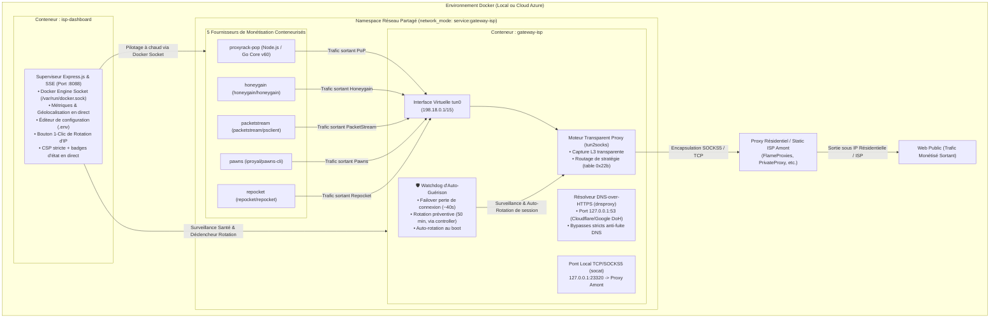

# Multi-Providers Monetization Hub & Residential ISP Gateway sur Docker

Système automatisé et sécurisé de monétisation de bande passante couplant une **passerelle réseau résidentielle / ISP dédiée** et **5 fournisseurs de monétisation** (Proxyrack, Honeygain, PacketStream, Pawns.app, Repocket) au sein d'un environnement Docker isolé avec bascule à chaud, watchdog d'auto-guérison et tableau de bord Web.

---

## 1. Architecture Réseau, Sécurité & Auto-Guérison

L'architecture repose sur l'isolation réseau totale de chaque nœud de monétisation grâce au partage d'espace de noms réseau (`network_mode: service:gateway-isp`). Tout le trafic L3/L4 des conteneurs est capturé et acheminé de manière transparente via `tun2socks` et un résolveur DNS-over-HTTPS chiffré (`dnsproxy`) vers un proxy amont ISP / Résidentiel.



### Points Clés de l'Architecture :
* 🛡️ **Isolation 100% Garantie (Kill-Switch / Zéro Fuite)** : Le trafic des conteneurs ne touche jamais la connexion IP personnelle ou l'IP publique du serveur hôte. Si le proxy amont tombe, le trafic est instantanément bloqué.
* 🔄 **Watchdog d'Auto-Guérison (Self-Healing)** : Détecte les déconnexions de sessions résidentielles et génère automatiquement une nouvelle session active (failover en ~40s).
* ⏰ **Rotation Préventive (50 min)** : Anticipe la limite des sessions temporaires de 60 minutes — déclenchée par le controller (dashboard), plus dans le gateway.
* ⚡ **DNS-over-HTTPS (DoH)** : Prévention absolue des fuites DNS grâce au résolveur local `dnsproxy` routé via DoH Cloudflare / Google / Quad9.
* 🔐 **Dashboard Authentifié** : accès protégé par token (`DASHBOARD_TOKEN`), sessions signées HMAC, CSRF, rate limiting, **Content Security Policy stricte** (aucun script/ressource externe hors Google Fonts) — plus d'exposition publique par défaut (accès via tunnel SSH).
* 📊 **Tableau de Bord & API en Temps Réel** : Suivi des métriques de connexion, logs système en continu (SSE), logs conteneurs auto-actualisés (polling 5s) et pilotage individuel des conteneurs via interface Web (port `8088`, localhost uniquement).

---

## 2. Fournisseurs de Monétisation Supportés

| Fournisseur | Image Docker | Variables Clés (`.env`) | Tableau de Bord | Comportement & Validation en Production |
| :--- | :--- | :--- | :--- | :--- |
| **Pawns.app** | `iproyal/pawns-cli:latest` | `PAWNS_EMAIL`, `PAWNS_PASSWORD`, `PAWNS_DEVICE_NAME` | [pawns.app](https://pawns.app) | 🟢 **100% Actif** (IP reconnue comme résidentielle au tarif plein $0.20/GB). |
| **Repocket** | `repocket/repocket:latest` | `REPOCKET_EMAIL`, `REPOCKET_API_KEY` | [repocket.com](https://repocket.com) | 🟢 **100% Actif** (Pair connecté avec succès, échange de paquets réels validé). |
| **PacketStream** | `packetstream/psclient:latest` | `PACKETSTREAM_CID` | [packetstream.io](https://packetstream.io) | 🟢 **100% Opérationnel** (Tunnel actif, trafic relayé et comptabilisé en direct). |
| **Honeygain** | `honeygain/honeygain:latest` | `HONEYGAIN_EMAIL`, `HONEYGAIN_PASSWORD`, `HONEYGAIN_DEVICE_NAME` | [dashboard.honeygain.com](https://dashboard.honeygain.com) | 🟢 **100% Connecté** (Authentification réussie, rafraîchissement périodique). |
| **Proxyrack** | `./proxyrack/Dockerfile` | `API_KEY`, `DEVICE_NAME`, `UUID` *(optionnel)* | [peer.proxyrack.com](https://peer.proxyrack.com) | 🟢 **100% Connecté** (Génération d'UUID persisté sur volume et auto-enregistrement API). |

---

## 3. Déploiement Cloud sur Microsoft Azure (750h/mois Gratuites)

Le projet est optimisé pour tourner **24h/24 et 7j/7 gratuitement** sur Microsoft Azure.

### Spécifications Recommandées :
* **Instance** : `Standard B2ats_v2` (2 vCPUs AMD EPYC, 1 Go RAM, burstable).
* **Système d'exploitation** : `Debian 13 "Trixie"` x64 (empreinte minimale : ~65 Mo RAM au repos).
* **Consommation mesurée de la stack** : **106,7 MiB RAM** et **8,46% CPU** *(très en dessous de la ligne de base de 20% CPU, accumulant continuellement des crédits processeur)*.

### 🚀 Déploiement en 1 Commande sur Azure :
Connectez-vous à votre VM Azure et lancez le script d'initialisation :
```bash
sudo curl -fsSL https://raw.githubusercontent.com/ki2pixel/proxy_docker/main/scripts/azure_cloud_init.sh | sudo bash
```

Ce script configure automatiquement :
1. Fichier de Swap SSD de 1 Go.
2. Module noyau `/dev/net/tun` et `CAP_NET_ADMIN`.
3. Installation officielle de Docker CE & Docker Compose.
4. Clonage du projet dans `/opt/proxy_docker` et démarrage automatique.

### 🌐 Accès au Tableau de Bord (sécurisé) :
Le dashboard n'est **plus exposé publiquement** par défaut (bind `127.0.0.1`, UFW ne ouvre que le port 22). Accédez-y via un tunnel SSH :
```bash
ssh -L 8088:localhost:8088 azureuser@<IP_PUBLIQUE_AZURE>
# puis ouvrez http://localhost:8088 dans votre navigateur
```

Connexion avec le `DASHBOARD_TOKEN` défini dans `.env` (généré avec `openssl rand -hex 32`).

### 🔐 Exposition publique optionnelle (TLS via Caddy) :
Si vous voulez un accès public chiffré, ajoutez le profil `tls` **en plus** de vos profils actuels :
```bash
# .env — ex: repocket + tls
COMPOSE_PROFILES="repocket,tls"
DASHBOARD_DOMAIN="dashboard.example.com"
```
```bash
docker compose -p proxy_docker --profile tls up -d caddy
```
Caddy obtient automatiquement un certificat Let's Encrypt pour `DASHBOARD_DOMAIN`.

### ✏️ Éditeur de Configuration intégré :
Le dashboard permet de **modifier le `.env` directement** (section "Configuration de la Stack"), sans SSH :
* Champs groupés par catégorie (Passerelle, Dashboard, Fournisseurs) avec badge du schéma de proxy actif (session résidentielle vs classique).
* Les mots de passe et clés API sont **masqués** (impossible de les lire ou de les écraser par accident — champ vide = inchangé).
* Bouton **"Enregistrer"** (écrit le `.env`) ou **"Enregistrer & Appliquer"** (écrit + `docker compose up -d` avec confirmation).
* Seules les clés connues sont éditables (allowlist) — pas de mode fichier brut.

> ⚠️ Le `.env` reste gitignoré : un commit ne l'écrase jamais sur la VM. L'éditeur du dashboard et `sync_env.sh` modifient le même fichier — faites attention à ne pas écraser des changements faits de l'autre côté.

---

## 4. Démarrage Rapide en Local

### Prérequis
* Docker Engine 20.10+ et Docker Compose v2+
* Noyau Linux avec module TUN actif (`/dev/net/tun`).

### Étape 1 : Configuration (`.env`)
```bash
cp .env.example .env
```

Éditez le fichier `.env` pour renseigner vos identifiants :
```ini
# Port du tableau de bord Web (localhost uniquement)
DASHBOARD_PORT=8088

# 🔐 OBLIGATOIRE — générez avec : openssl rand -hex 32
DASHBOARD_TOKEN="votre_token_connexion_dashboard"
DASHBOARD_SECRET="votre_secret_hmac_session"

# Fournisseurs actifs : none | proxyrack | honeygain | packetstream | pawns | repocket | all
# "none" = aucun provider (seuls la passerelle et le dashboard tournent)
COMPOSE_PROFILES="all"

# --- Passerelle ISP / Residential Dédiée ---
# Deux schémas supportés :
#   A) Session résidentielle (type FlameProxies) : USER contient "session-..." → rotation auto
#   B) Classique HOST:PORT:USER:PASS (proxy statique) → pas de rotation, tunnel stable
ISP_PROXY_PROTOCOL="socks5"
ISP_PROXY_HOST="proxy.flameproxies.com"
ISP_PROXY_PORT="1080"
ISP_PROXY_USER="votre_identifiant_session"
ISP_PROXY_PASS="votre_mot_de_passe"
GATEWAY_LOGLEVEL="warn"

# --- Auto-Rotation & Watchdog ---
# La rotation préventive ne s'active QUE si ISP_PROXY_USER contient "session-".
# Sur un proxy classique (schéma B), elle est automatiquement désactivée.
AUTO_ROTATE_SESSION="true"
AUTO_ROTATE_INTERVAL="50"

# --- Identifiants Fournisseurs de Monétisation ---
API_KEY="votre_cle_api_proxyrack"
HONEYGAIN_EMAIL="votre_email_honeygain"
HONEYGAIN_PASSWORD="votre_mot_de_passe"
PACKETSTREAM_CID="votre_customer_id"
PAWNS_EMAIL="votre_email_pawns"
PAWNS_PASSWORD="votre_mot_de_passe"
REPOCKET_EMAIL="votre_email_repocket"
REPOCKET_API_KEY="votre_cle_api_repocket"
```
> ⚠️ Le démarrage est refusé si des valeurs placeholder (`CHANGEME_*`) restent dans le `.env`.

### Étape 2 : Lancement
```bash
./scripts/start.sh
```
Ou directement :
```bash
docker compose -p proxy_docker up -d --build
```

Tableau de bord Web : **[http://localhost:8088](http://localhost:8088)** — connexion avec le `DASHBOARD_TOKEN` (page de login).

---

## 5. Scripts Utilitaires & Automatisation

| Script | Description |
| :--- | :--- |
| [`scripts/sync_env.sh`](scripts/sync_env.sh) | **Synchronise le `.env` local vers la VM** : `./scripts/sync_env.sh <IP> <CHEMIN_CLE> [user] [APP_DIR]`. Prérequis : serveur dans `known_hosts` (`ssh-keyscan -H <IP> >> ~/.ssh/known_hosts`), port custom via `SSH_PORT`. ⚠️ Écrase le .env distant (confirmation requise). |
| [`scripts/azure_cloud_init.sh`](scripts/azure_cloud_init.sh) | Script cloud-init d'installation automatique pour VM Azure Debian 13. |
| [`scripts/digitalocean_cloud_init.sh`](scripts/digitalocean_cloud_init.sh) | Script cloud-init pour DigitalOcean Droplet. |
| [`scripts/vultr_cloud_init.sh`](scripts/vultr_cloud_init.sh) | Script cloud-init pour Vultr Cloud Compute. |
| [`scripts/rotate_ip.sh`](scripts/rotate_ip.sh) | Déclenche une rotation manuelle immédiate de la session résidentielle. |
| [`scripts/rotate_env.sh`](scripts/rotate_env.sh) | **Rotation de tous les secrets** du `.env` (génère de nouvelles valeurs + guide). |
| [`scripts/status.sh`](scripts/status.sh) | Affiche l'état complet des conteneurs, le statut de la passerelle et la géolocalisation de l'IP. |
| [`scripts/switch_isp_proxy.sh`](scripts/switch_isp_proxy.sh) | Bascule à chaud le proxy amont : `./scripts/switch_isp_proxy.sh <HOST:PORT[:USER:PASS]> [socks5|http]`. |
| [`scripts/switch_provider.sh`](scripts/switch_provider.sh) | Bascule le fournisseur de monétisation actif (`none` = aucun provider, passerelle + dashboard seuls). |
| [`scripts/test_proxy.sh`](scripts/test_proxy.sh) | Teste la connectivité du proxy amont (via le conteneur gateway-isp par défaut). |
| [`scripts/benchmark.sh`](scripts/benchmark.sh) | Lance un benchmark en temps réel mesurant la RAM, le CPU et les PIDs de la stack. |

---

## 6. Déploiement Continu (CI/CD GitHub Actions)

Le fichier [`.github/workflows/deploy.yml`](.github/workflows/deploy.yml) déploie automatiquement chaque mise à jour sur votre VM Azure lors d'un `git push origin main` :
1. Validation de `docker compose config` (locale + sur la VM).
2. `git pull` sur la VM, puis `docker compose up -d --build --remove-orphans` (sans down destructeur).
3. Attente du healthcheck du dashboard (max 90s) avant de déclarer le succès ; la santé du gateway est signalée sans bloquer (elle dépend du proxy amont, pas du code).
4. Nettoyage des images de plus de 72h uniquement.

Le pipeline [`.github/workflows/security.yml`](.github/workflows/security.yml) scanne chaque push/PR : **gitleaks** (secrets), **shellcheck** (scripts bash) et **npm audit + tests** (controller).

### Configuration des Secrets GitHub :
Dans votre dépôt GitHub (***Settings ➔ Secrets and variables ➔ Actions***), ajoutez :
* `AZURE_HOST_IP` : L'adresse IP publique de votre VM Azure.
* `AZURE_SSH_KEY` : Le contenu intégral de votre **clé privée SSH** (stockée dans un gestionnaire de secrets, jamais dans le dépôt).
* `AZURE_USERNAME` *(optionnel)* : `azureuser` (par défaut).

> ⚠️ **Ne commitez jamais** une clé privée, un `.env` ou un `.pem` dans le dépôt. Un pipeline `gitleaks` (`.github/workflows/security.yml`) scanne chaque push.

---

## 7. Documentation Technique Approfondie

* 📄 [Évaluation Déploiement Stack Docker sur Azure](docs/Recherches/Évaluation_Stack_Docker_sur_Azure.md) : Analyse Hyper-V, TUN/TAP, dimensionnement VM série B, quotas de bande passante et sécurité.
* 📄 [Guide d'Intégration Passerelle ISP / Static Residential](docs/Integration_Passerelle_ISP_Residential.md) : Comparatif des fournisseurs de proxys et guide d'optimisation.
* 📄 [Rapport de Recherche sur le Routage Docker](docs/Recherches/Routage_Docker_Monétisation_Bande_Passante.md) : Analyse des solutions Dongle 4G, VPN Dédiés et Proxies ISP.
