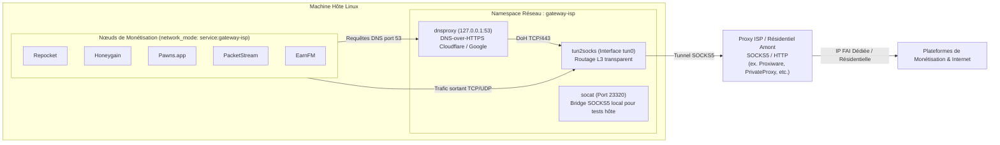

# Guide d'Intégration & Exploitation : Passerelle Dédiée Static ISP / Residential

Ce document décrit l'architecture déployée et la procédure d'exploitation pour la **Passerelle Proxy Dédiée Static ISP / Residential** à **bande passante illimitée**, garantissant l'isolation totale et la protection de l'adresse IP de votre domicile.

---

## 1. Architecture Technique Réalisée

Le conteneur passerelle **`gateway-isp`** assure l'interception transparente du trafic réseau L3/L4 pour tous les conteneurs de monétisation (*Repocket, Honeygain, Pawns.app, PacketStream, EarnFM*).



### Caractéristiques Clés :
1. **Transparence L3 Intégrale :** Aucun paramétrage de proxy interne n'est requis dans les applications de monétisation.
2. **Résolveur DNS-over-HTTPS (DoH) Intégré :** Les proxys SOCKS5 ne gèrent pas toujours le trafic UDP brut. Le composant `dnsproxy` écoute localement sur `127.0.0.1:53` et achemine les résolutions DNS via HTTPS (`1.1.1.1` et `8.8.8.8`) à travers le proxy.
3. **Zéro Fuite d'IP Locale (Kill-Switch) :** En cas d'interruption du proxy distant, le trafic est bloqué et ne retombe jamais sur votre connexion personnelle.
4. **Bridge Local de Diagnostic (interne) :** Le conteneur `gateway-isp` expose un pont SOCKS5 sur `127.0.0.1:23320` (loopback uniquement, plus de port publié sur le host depuis le durcissement). Testez depuis le dashboard ou avec `./scripts/test_proxy.sh` (passe par `docker exec gateway-isp`).

---

## 2. Commandes d'Exploitation Rapide

### 1. Démarrer la Stack ISP
```bash
./scripts/start.sh
```

### 2. Configurer ou Changer de Proxy Manuellement
Pour basculer vers un proxy spécifique :
```bash
./scripts/switch_isp_proxy.sh proxy.votre-fournisseur.com:1080 socks5
```

### 3. Vérifier l'État Complet & Diagnostics
Affiche les conteneurs actifs, l'IP publique active de la passerelle, et la résolution DNS :
```bash
./scripts/status.sh
```

### 4. Tester la Connectivité SOCKS5 depuis l'Hôte
```bash
./scripts/test_proxy.sh
```

---

## 3. Configuration des Variables (`.env`)

```ini
# ==============================================================================
# Passerelle Dédiée Static ISP / Residential
# ==============================================================================
ISP_PROXY_PROTOCOL="socks5"
ISP_PROXY_HOST="CHANGEME_proxy1.example.com"
ISP_PROXY_PORT="1080"
ISP_PROXY_USER="votre_utilisateur"
ISP_PROXY_PASS="votre_mot_de_passe"
GATEWAY_LOGLEVEL="warn"

# Profils de monétisation actifs au démarrage
COMPOSE_PROFILES="repocket"
```

---

## 4. Résultats des Tests de Validation en Direct

| Service | Statut de Connexion | IP Validée | Notes |
| :--- | :--- | :--- | :--- |
| **Passerelle `gateway-isp`** | [✓] Healthy | `194.70.234.223` (Paris, FR) | Latence ~240 ms, DoH Cloudflare opérationnel |
| **Repocket** | [✓] Actif & Connecté | `194.70.234.223` (Paris, FR) | Authentification 200 OK, `markPeerAsAlive` |
| **Bridge Local (interne 127.0.0.1:23320)** | [✓] Opérationnel | `194.70.234.223` (Paris, FR) | Test curl réussi via `./scripts/test_proxy.sh` |
